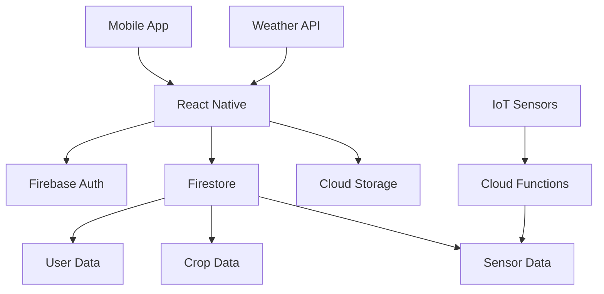

## Overview

The **App de Gestión Agrícola** brings technology to the service of Chitagá's agricultural sector. This mobile application helps our farmers register, optimize, and improve their crops using modern tools and data.

<Note>
  **Mission**: Tecnología al servicio del campo chitagüense. Una app para que nuestros agricultores registren, optimicen y mejoren sus cultivos.
</Note>

## Local Impact

Agriculture is the backbone of Chitagá's economy. This app empowers farmers with:

<CardGroup cols={2}>
  <Card title="Data-Driven Decisions" icon="chart-mixed">
    Make informed decisions based on real crop data and analytics
  </Card>
  
  <Card title="Increased Productivity" icon="seedling">
    Optimize planting, irrigation, and harvesting schedules
  </Card>
  
  <Card title="Cost Reduction" icon="money-bill-trend-up">
    Minimize waste and reduce input costs through better planning
  </Card>
  
  <Card title="Knowledge Sharing" icon="people-arrows">
    Learn from other farmers and share successful practices
  </Card>
</CardGroup>

## Technology Stack

<Tabs>
  <Tab title="React Native">
    ### Cross-Platform Mobile
    
    React Native delivers native app experience on Android and iOS:
    
    - **Single Codebase**: Develop once, deploy to both platforms
    - **Native Performance**: Smooth, responsive user interface
    - **Offline-First**: Works without internet connection
    - **Cost-Effective**: Faster development than native apps
    
    ```jsx
    // Example: Crop tracking component
    import { View, Text, FlatList } from 'react-native';
    
    function CropList({ crops }) {
      return (
        <FlatList
          data={crops}
          renderItem={({ item }) => (
            <View style={styles.cropCard}>
              <Text style={styles.cropName}>{item.name}</Text>
              <Text>Planted: {item.plantingDate}</Text>
              <Text>Status: {item.status}</Text>
            </View>
          )}
          keyExtractor={item => item.id}
        />
      );
    }
    ```
  </Tab>
  
  <Tab title="Firebase">
    ### Real-Time Backend
    
    Firebase provides complete backend infrastructure:
    
    - **Firestore Database**: Real-time cloud database
    - **Authentication**: Secure user login and management
    - **Cloud Storage**: Store crop photos and documents
    - **Offline Support**: Automatic data synchronization
    - **Cloud Functions**: Server-side logic and automation
    
    ```javascript
    // Example: Save crop data
    import { firestore } from './firebase';
    
    async function saveCrop(userId, cropData) {
      await firestore
        .collection('users')
        .doc(userId)
        .collection('crops')
        .add({
          ...cropData,
          createdAt: firebase.firestore.FieldValue.serverTimestamp()
        });
    }
    
    // Real-time updates
    const unsubscribe = firestore
      .collection('users')
      .doc(userId)
      .collection('crops')
      .onSnapshot(snapshot => {
        const crops = snapshot.docs.map(doc => ({
          id: doc.id,
          ...doc.data()
        }));
        updateCropList(crops);
      });
    ```
  </Tab>
  
  <Tab title="IoT Integration">
    ### Smart Agriculture
    
    IoT sensors provide real-time field data:
    
    - **Soil Moisture**: Monitor irrigation needs
    - **Temperature**: Track growing conditions
    - **Weather Data**: Integrate local weather stations
    - **Alerts**: Automatic notifications for critical conditions
    
    ```javascript
    // Example: IoT sensor data integration
    interface SensorData {
      sensorId: string;
      timestamp: Date;
      soilMoisture: number;  // percentage
      temperature: number;    // celsius
      humidity: number;       // percentage
    }
    
    function analyzeSensorData(data: SensorData) {
      const needsWatering = data.soilMoisture < 30;
      const optimalTemp = data.temperature >= 18 && data.temperature <= 25;
      
      return {
        irrigationNeeded: needsWatering,
        conditions: optimalTemp ? 'optimal' : 'suboptimal',
        recommendations: generateRecommendations(data)
      };
    }
    ```
  </Tab>
</Tabs>

## Key Features

<AccordionGroup>
  <Accordion title="Crop Management" icon="wheat">
    Complete lifecycle tracking for all crops:
    - Register new plantings with variety, area, and dates
    - Track growth stages and milestones
    - Log maintenance activities (irrigation, fertilization, pest control)
    - Record harvest data and yields
    - Photo documentation throughout the cycle
    
    Features:
    - Multiple crop support
    - Calendar view of activities
    - Reminders and notifications
    - Historical data analysis
  </Accordion>
  
  <Accordion title="Field Monitoring" icon="satellite">
    Track field conditions in real-time:
    - Soil moisture levels
    - Temperature and humidity
    - Weather forecasts
    - Pest and disease alerts
    
    Integration with:
    - IoT sensors
    - Weather stations
    - Satellite imagery (planned)
  </Accordion>
  
  <Accordion title="Analytics Dashboard" icon="chart-line">
    Visualize farm performance:
    - Yield trends over time
    - Cost per crop analysis
    - Resource usage tracking
    - Profitability reports
    - Comparison with previous seasons
    
    Export data to:
    - PDF reports
    - Excel spreadsheets
    - CSV files
  </Accordion>
  
  <Accordion title="Knowledge Base" icon="book">
    Agricultural resources and best practices:
    - Crop cultivation guides
    - Pest identification and treatment
    - Fertilization recommendations
    - Irrigation best practices
    - Seasonal planting calendar
    - Community tips and experiences
  </Accordion>
  
  <Accordion title="Community Features" icon="users">
    Connect with other farmers:
    - Share experiences and tips
    - Ask questions and get advice
    - Showcase successful harvests
    - Organize collective purchases
    - Market excess production
  </Accordion>
</AccordionGroup>

## Architecture



## Getting Started

<Steps>
  <Step title="Clone the Repository">
    ```bash
    git clone https://github.com/chitaga-tech/agricultural-app.git
    cd agricultural-app
    ```
  </Step>
  
  <Step title="Install Dependencies">
    ```bash
    npm install
    # or
    yarn install
    ```
  </Step>
  
  <Step title="Configure Firebase">
    Create `firebase.config.js`:
    ```javascript
    export const firebaseConfig = {
      apiKey: "your-api-key",
      authDomain: "your-auth-domain",
      projectId: "your-project-id",
      storageBucket: "your-storage-bucket",
      messagingSenderId: "your-messaging-sender-id",
      appId: "your-app-id"
    };
    ```
  </Step>
  
  <Step title="Run on Device/Simulator">
    For iOS:
    ```bash
    npx react-native run-ios
    ```
    
    For Android:
    ```bash
    npx react-native run-android
    ```
  </Step>
</Steps>

## Development Roadmap

<Steps>
  <Step title="Phase 1: Core Features" icon="seedling">
    - ✅ User authentication
    - ✅ Basic crop registration
    - 🔄 Activity logging
    - 🔄 Photo uploads
  </Step>
  
  <Step title="Phase 2: Data & Analytics" icon="chart-pie">
    - 🔄 Analytics dashboard
    - ⏳ Yield tracking
    - ⏳ Cost analysis
    - ⏳ Report generation
  </Step>
  
  <Step title="Phase 3: IoT Integration" icon="microchip">
    - ⏳ Sensor connectivity
    - ⏳ Real-time monitoring
    - ⏳ Automated alerts
    - ⏳ Weather integration
  </Step>
  
  <Step title="Phase 4: Community" icon="users">
    - ⏳ Farmer profiles
    - ⏳ Knowledge sharing
    - ⏳ Marketplace
    - ⏳ Cooperative features
  </Step>
</Steps>

## Usage Examples

### Register a New Crop

```javascript
import { addCrop } from './services/cropService';

const newCrop = {
  name: 'Maíz',
  variety: 'ICA V-305',
  area: 2.5,  // hectares
  plantingDate: new Date('2026-03-15'),
  expectedHarvest: new Date('2026-07-15'),
  location: {
    latitude: 7.1167,
    longitude: -72.6833
  }
};

await addCrop(userId, newCrop);
```

### Log Farm Activity

```javascript
import { logActivity } from './services/activityService';

const activity = {
  cropId: 'crop-123',
  type: 'irrigation',
  date: new Date(),
  duration: 120,  // minutes
  notes: 'Applied drip irrigation'
};

await logActivity(userId, activity);
```

### Monitor Sensor Data

```javascript
import { subscribeSensorData } from './services/sensorService';

subscribeSensorData(sensorId, (data) => {
  if (data.soilMoisture < 30) {
    sendNotification({
      title: 'Irrigation Needed',
      body: 'Soil moisture is low in Field A'
    });
  }
});
```

<Tip>
  The app works offline! All data is cached locally and syncs when you have internet connection.
</Tip>

## Screen Previews

<CardGroup cols={2}>
  <Card title="Home Dashboard" icon="house">
    Overview of all crops and recent activities
  </Card>
  
  <Card title="Crop Details" icon="leaf">
    Complete information and history for each crop
  </Card>
  
  <Card title="Activity Log" icon="clipboard-list">
    Track all farm activities and maintenance
  </Card>
  
  <Card title="Analytics" icon="chart-simple">
    Visualize farm performance and trends
  </Card>
</CardGroup>

## Target Users

<AccordionGroup>
  <Accordion title="Small-Scale Farmers">
    Perfect for farmers managing 1-10 hectares:
    - Simple, intuitive interface
    - Works on basic smartphones
    - Offline capability essential
    - Spanish language support
  </Accordion>
  
  <Accordion title="Medium Farms">
    Features for larger operations:
    - Multiple field management
    - Worker activity tracking
    - Advanced analytics
    - Export capabilities
  </Accordion>
  
  <Accordion title="Agricultural Cooperatives">
    Tools for community organizations:
    - Shared knowledge base
    - Collective planning
    - Bulk purchasing
    - Joint marketing
  </Accordion>
</AccordionGroup>

## Impact Metrics

| Metric | Current | Goal (2026) |
|--------|---------|-------------|
| Active Farmers | 8 | 200 |
| Crops Tracked | 45 | 1,000 |
| IoT Sensors Deployed | 0 | 20 |
| Avg. Yield Improvement | - | 15% |

<Warning>
  This app is in active development. Features may change as we gather feedback from our farming community.
</Warning>

## Contributing

We welcome contributions from developers, farmers, and agricultural experts:

<CardGroup cols={2}>
  <Card title="Developers" icon="code">
    Help build features and fix bugs
  </Card>
  
  <Card title="Farmers" icon="user">
    Test the app and provide feedback
  </Card>
  
  <Card title="Agronomists" icon="flask">
    Contribute to the knowledge base
  </Card>
  
  <Card title="Designers" icon="palette">
    Improve UX for better usability
  </Card>
</CardGroup>