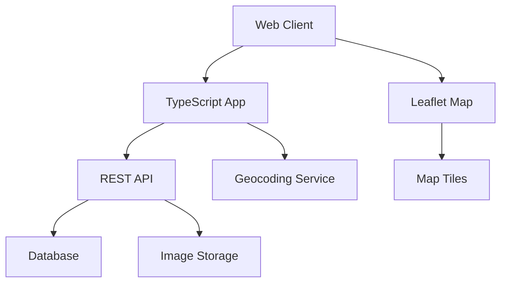

## Overview

The **Mapa Digital de Chitagá** puts our municipality on the digital map, showcasing local businesses, tourist routes, and points of interest to increase visibility for what we have to offer.

<Note>
  **Mission**: Poner a Chitagá en el mapa digital: comercios, rutas turísticas y puntos de interés que visibilicen lo que tenemos.
</Note>

## Local Impact

The Digital Map transforms how Chitagá connects with visitors and residents:

<CardGroup cols={2}>
  <Card title="Business Visibility" icon="store">
    Local businesses gain digital presence, reaching more potential customers
  </Card>
  
  <Card title="Tourism Growth" icon="plane-departure">
    Tourist routes and attractions become discoverable online
  </Card>
  
  <Card title="Economic Development" icon="chart-line-up">
    Increased visibility drives economic opportunities for the community
  </Card>
  
  <Card title="Cultural Preservation" icon="landmark">
    Document and share our local heritage and points of interest
  </Card>
</CardGroup>

## Technology Stack

<Tabs>
  <Tab title="Leaflet">
    ### Interactive Mapping
    
    Leaflet provides powerful, lightweight mapping capabilities:
    
    - **Open Source**: No vendor lock-in or licensing costs
    - **Lightweight**: Fast loading on mobile devices
    - **Customizable**: Tailored to Chitagá's specific needs
    - **Mobile-First**: Optimized for smartphone users
    
    ```javascript
    // Example: Initialize Chitagá map
    const map = L.map('map').setView([7.1167, -72.6833], 13);
    
    L.tileLayer('https://{s}.tile.openstreetmap.org/{z}/{x}/{y}.png', {
      attribution: '© OpenStreetMap contributors'
    }).addTo(map);
    
    // Add local business marker
    L.marker([7.1167, -72.6833])
      .addTo(map)
      .bindPopup('Local Business Name');
    ```
  </Tab>
  
  <Tab title="TypeScript">
    ### Type-Safe Development
    
    TypeScript ensures reliable, maintainable code:
    
    - **Type Safety**: Catch errors before runtime
    - **Better IDE Support**: Autocomplete and refactoring
    - **Documentation**: Self-documenting code
    - **Scalability**: Easier to maintain as project grows
    
    ```typescript
    // Example: Business location type definition
    interface Business {
      id: string;
      name: string;
      category: 'restaurant' | 'hotel' | 'store' | 'service';
      coordinates: [number, number];
      description: string;
      hours?: string;
      contact?: string;
    }
    
    function addBusinessMarker(business: Business) {
      const marker = L.marker(business.coordinates);
      marker.bindPopup(createPopupContent(business));
      return marker;
    }
    ```
  </Tab>
  
  <Tab title="API REST">
    ### Data Management
    
    RESTful API for managing map data:
    
    - **CRUD Operations**: Create, read, update, delete locations
    - **Search & Filter**: Find businesses by category or name
    - **User Contributions**: Community can submit new locations
    - **Data Validation**: Ensure quality of map information
    
    ```typescript
    // Example: API endpoints
    GET    /api/businesses          // List all businesses
    GET    /api/businesses/:id      // Get specific business
    POST   /api/businesses          // Add new business
    PUT    /api/businesses/:id      // Update business
    DELETE /api/businesses/:id      // Remove business
    
    GET    /api/routes              // List tourist routes
    GET    /api/points-of-interest  // List POIs
    ```
  </Tab>
</Tabs>

## Key Features

<AccordionGroup>
  <Accordion title="Business Directory" icon="building">
    Comprehensive listing of local businesses:
    - Restaurants and cafes
    - Hotels and accommodations
    - Retail stores
    - Professional services
    - Agriculture and produce
    
    Each listing includes:
    - Location on map
    - Contact information
    - Business hours
    - Photos and descriptions
    - User reviews and ratings
  </Accordion>
  
  <Accordion title="Tourist Routes" icon="map-marked">
    Curated routes showcasing Chitagá's attractions:
    - Historical landmarks tour
    - Natural landscapes route
    - Agricultural heritage trail
    - Cultural sites circuit
    
    Features:
    - Turn-by-turn directions
    - Estimated duration
    - Difficulty ratings
    - Photo galleries
  </Accordion>
  
  <Accordion title="Points of Interest" icon="location-dot">
    Important community locations:
    - Parks and recreation areas
    - Churches and religious sites
    - Government buildings
    - Educational institutions
    - Healthcare facilities
    - Community centers
  </Accordion>
  
  <Accordion title="Community Contributions" icon="users-gear">
    Empower residents to maintain the map:
    - Submit new businesses
    - Update existing information
    - Add photos and reviews
    - Report errors or changes
    - Suggest new routes
  </Accordion>
</AccordionGroup>

## Map Categories

<CardGroup cols={3}>
  <Card title="Restaurants" icon="utensils" color="#ea5545">
    Local dining and cuisine
  </Card>
  
  <Card title="Hotels" icon="bed" color="#f46a9b">
    Accommodations and lodging
  </Card>
  
  <Card title="Stores" icon="cart-shopping" color="#ef9b20">
    Retail and shopping
  </Card>
  
  <Card title="Services" icon="wrench" color="#edbf33">
    Professional services
  </Card>
  
  <Card title="Tourism" icon="mountain-sun" color="#ede15b">
    Attractions and sites
  </Card>
  
  <Card title="Agriculture" icon="wheat" color="#bdcf32">
    Farms and produce
  </Card>
</CardGroup>

## Architecture



## Getting Started

<Steps>
  <Step title="Clone the Repository">
    ```bash
    git clone https://github.com/chitaga-tech/digital-map.git
    cd digital-map
    ```
  </Step>
  
  <Step title="Install Dependencies">
    ```bash
    npm install
    ```
  </Step>
  
  <Step title="Configure Environment">
    Create a `.env` file:
    ```env
    DATABASE_URL=your_database_url
    MAP_CENTER_LAT=7.1167
    MAP_CENTER_LNG=-72.6833
    DEFAULT_ZOOM=13
    ```
  </Step>
  
  <Step title="Run Development Server">
    ```bash
    npm run dev
    ```
    
    The map will be available at `http://localhost:3000`
  </Step>
</Steps>

## Development Roadmap

<Steps>
  <Step title="Phase 1: Core Map" icon="map">
    - ✅ Basic map implementation
    - 🔄 Business markers
    - 🔄 Category filtering
  </Step>
  
  <Step title="Phase 2: Content" icon="database">
    - ⏳ Business directory API
    - ⏳ Tourist routes
    - ⏳ Points of interest
  </Step>
  
  <Step title="Phase 3: Community" icon="users">
    - ⏳ User submissions
    - ⏳ Reviews and ratings
    - ⏳ Photo uploads
  </Step>
  
  <Step title="Phase 4: Advanced" icon="sparkles">
    - ⏳ Mobile app
    - ⏳ Offline maps
    - ⏳ Turn-by-turn navigation
    - ⏳ AR features
  </Step>
</Steps>

## Usage Examples

### Finding a Business

```typescript
// Search for restaurants
const restaurants = await fetch('/api/businesses?category=restaurant');
const data = await restaurants.json();

data.forEach(restaurant => {
  addBusinessMarker(restaurant);
});
```

### Adding a New Location

```typescript
// Submit a new business
const newBusiness = {
  name: 'Mi Tienda Local',
  category: 'store',
  coordinates: [7.1167, -72.6833],
  description: 'Local products and crafts',
  hours: 'Mon-Sat 8am-6pm'
};

await fetch('/api/businesses', {
  method: 'POST',
  headers: { 'Content-Type': 'application/json' },
  body: JSON.stringify(newBusiness)
});
```

<Tip>
  The map uses OpenStreetMap tiles, which are free and open source. No API keys required!
</Tip>

## Impact Metrics

| Metric | Current | Goal (2026) |
|--------|---------|-------------|
| Businesses Listed | 0 | 100 |
| Tourist Routes | 0 | 10 |
| Points of Interest | 0 | 50 |
| Monthly Visitors | 0 | 2,000 |

<Warning>
  This project is in the planning phase. The map is not yet publicly available.
</Warning>