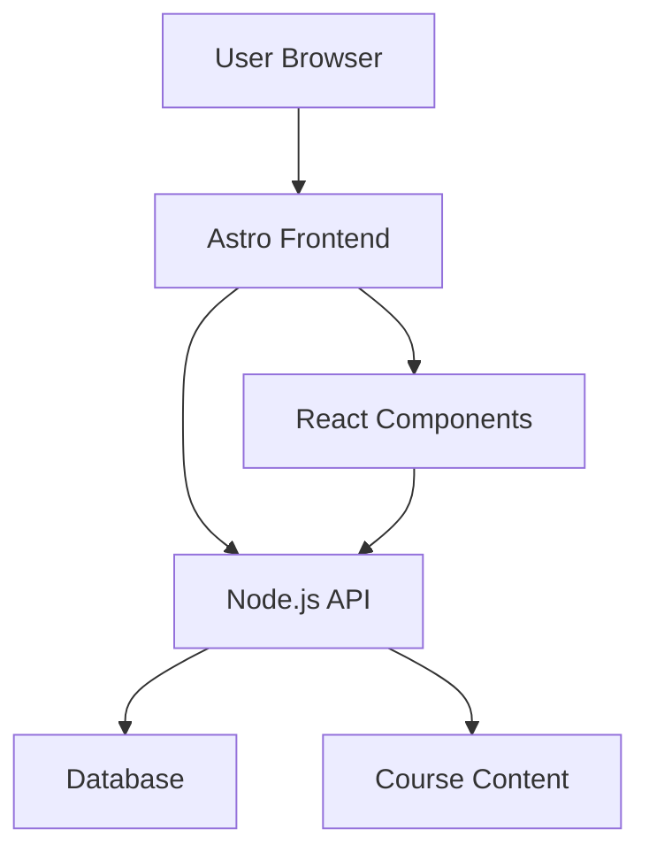

## Overview

The **Portal Educativo Chitagá** is a single destination where any chitagüense can find courses, resources, and learning opportunities without depending on external platforms. This project empowers our community with accessible, quality education.

<Note>
  **Mission**: Un solo lugar donde cualquier chitagüense pueda encontrar cursos, recursos y oportunidades de formación sin depender de nadie de afuera.
</Note>

## Local Impact

The Educational Portal addresses critical educational challenges in Chitagá:

<CardGroup cols={2}>
  <Card title="Centralized Access" icon="circle-nodes">
    All learning resources in one place, eliminating the need to search multiple platforms
  </Card>
  
  <Card title="Local Autonomy" icon="house-flag">
    Community-owned education infrastructure, independent from external dependencies
  </Card>
  
  <Card title="Free Resources" icon="hand-holding-heart">
    No paywalls or subscriptions - education for everyone
  </Card>
  
  <Card title="Cultural Relevance" icon="mountain">
    Content tailored to local context and needs
  </Card>
</CardGroup>

## Technology Stack

<Tabs>
  <Tab title="Astro">
    ### Why Astro?
    
    Astro powers the portal with exceptional performance:
    
    - **Fast Loading**: Static site generation for instant page loads
    - **SEO Optimized**: Better discoverability for educational content
    - **Low Bandwidth**: Important for areas with limited internet
    - **Modern DX**: Great developer experience for contributors
    
    ```astro
    ---
    // Example: Course listing page
    import CourseCard from '../components/CourseCard.astro';
    const courses = await getCourses();
    ---
    
    <section class="courses">
      {courses.map(course => <CourseCard {...course} />)}
    </section>
    ```
  </Tab>
  
  <Tab title="React">
    ### Interactive Components
    
    React handles dynamic user interactions:
    
    - **Course Navigation**: Interactive filtering and search
    - **Progress Tracking**: Real-time learning progress
    - **User Dashboards**: Personalized learning paths
    - **Quiz Systems**: Interactive assessments
    
    ```jsx
    // Example: Course progress tracker
    function CourseProgress({ courseId, userId }) {
      const [progress, setProgress] = useState(0);
      
      return (
        <div className="progress-bar">
          <div style={{ width: `${progress}%` }} />
        </div>
      );
    }
    ```
  </Tab>
  
  <Tab title="Node.js">
    ### Backend Services
    
    Node.js powers the server-side logic:
    
    - **User Authentication**: Secure login and registration
    - **Course Management**: CRUD operations for content
    - **Progress API**: Track and retrieve learning progress
    - **Content Delivery**: Serve courses and resources
    
    ```javascript
    // Example: Course API endpoint
    app.get('/api/courses/:id', async (req, res) => {
      const course = await getCourseById(req.params.id);
      res.json(course);
    });
    ```
  </Tab>
</Tabs>

## Key Features

<AccordionGroup>
  <Accordion title="Course Catalog" icon="book-open">
    Browse a comprehensive catalog of courses across multiple disciplines:
    - Technology and programming
    - Agriculture and sustainability
    - Business and entrepreneurship
    - Arts and culture
    - Language learning
  </Accordion>
  
  <Accordion title="Learning Paths" icon="route">
    Structured learning journeys tailored to goals:
    - Beginner to advanced progressions
    - Skill-based tracks
    - Career-oriented paths
    - Custom learning plans
  </Accordion>
  
  <Accordion title="Community Resources" icon="users">
    Collaborative learning features:
    - Discussion forums
    - Peer mentoring
    - Study groups
    - Knowledge sharing
  </Accordion>
  
  <Accordion title="Progress Tracking" icon="chart-line">
    Monitor your learning journey:
    - Course completion status
    - Achievement badges
    - Learning analytics
    - Personalized recommendations
  </Accordion>
</AccordionGroup>

## Architecture



## Getting Started

<Steps>
  <Step title="Clone the Repository">
    ```bash
    git clone https://github.com/chitaga-tech/educational-portal.git
    cd educational-portal
    ```
  </Step>
  
  <Step title="Install Dependencies">
    ```bash
    npm install
    ```
  </Step>
  
  <Step title="Configure Environment">
    Create a `.env` file with required variables:
    ```env
    DATABASE_URL=your_database_url
    API_KEY=your_api_key
    ```
  </Step>
  
  <Step title="Run Development Server">
    ```bash
    npm run dev
    ```
    
    Visit `http://localhost:3000` to see the portal
  </Step>
</Steps>

## Development Roadmap

<Steps>
  <Step title="Phase 1: Foundation" icon="flag">
    - ✅ Basic portal structure
    - ✅ Course catalog display
    - 🔄 User authentication
  </Step>
  
  <Step title="Phase 2: Interactivity" icon="gears">
    - 🔄 Progress tracking
    - ⏳ Quiz system
    - ⏳ Discussion forums
  </Step>
  
  <Step title="Phase 3: Community" icon="users">
    - ⏳ Peer mentoring
    - ⏳ User-generated content
    - ⏳ Certificate system
  </Step>
  
  <Step title="Phase 4: Scale" icon="rocket">
    - ⏳ Mobile app
    - ⏳ Offline support
    - ⏳ Multi-language support
  </Step>
</Steps>

<Tip>
  Want to contribute? Check out our [GitHub repository](#) for open issues and contribution guidelines.
</Tip>

## Impact Metrics

We measure success through community impact:

| Metric | Current | Goal (2026) |
|--------|---------|-------------|
| Active Users | 45 | 500 |
| Available Courses | 12 | 100 |
| Course Completions | 23 | 1,000 |
| Community Contributors | 5 | 25 |

<Warning>
  This project is in active development. Features and APIs may change.
</Warning>